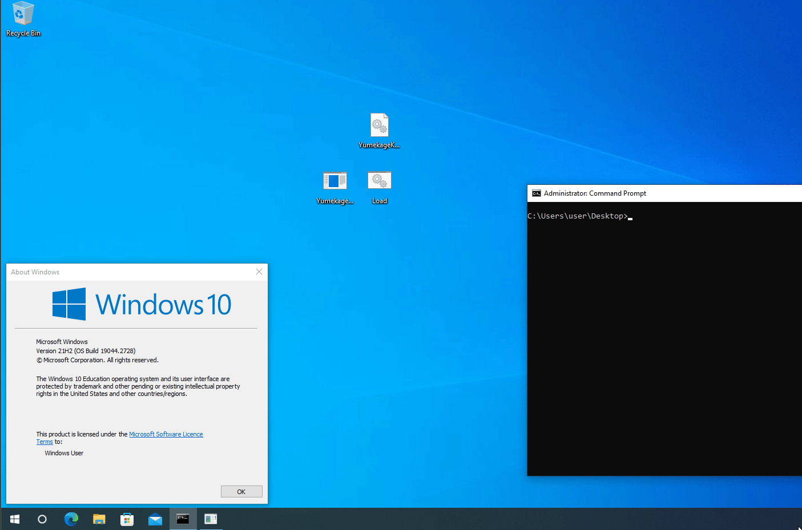
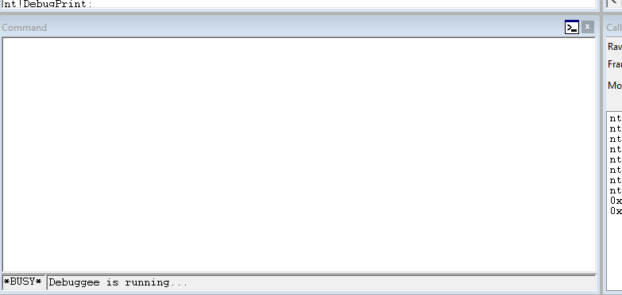

# Yumekage
This repository contains a demo proof of concept implementation for shadowing memory regions in Windows. It was created as part of a blog post discussing the topic and also serves as a basis for the HyperDeceit project which is available at https://github.com/Xyrem/HyperDeceit.

Please do not use this code for production, as it is no where near ready for it. However bug reports and feedback are welcome.

Blog post: https://reversing.info/posts/guardedregions

## Media

## Credits
- [Everdox](https://www.linkedin.com/in/everdox) for coming up with the idea of abusing context swaps to create hidden memory.
